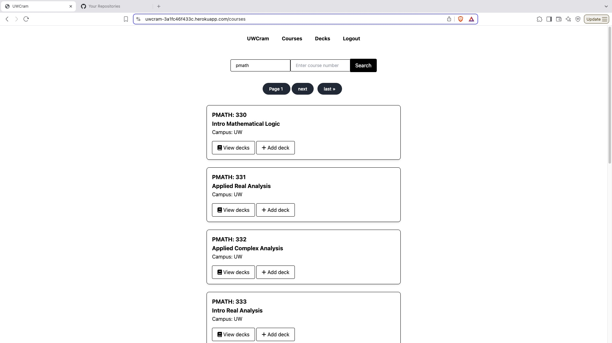
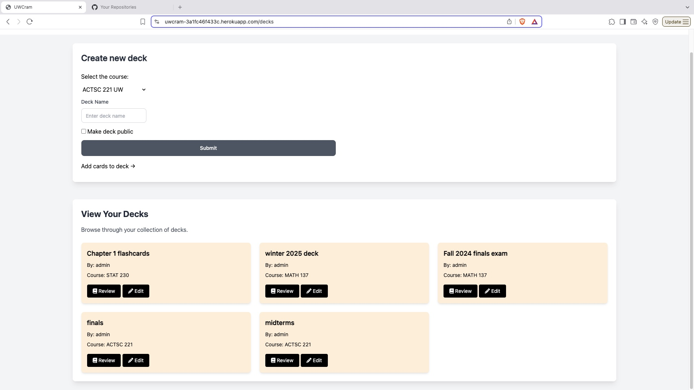
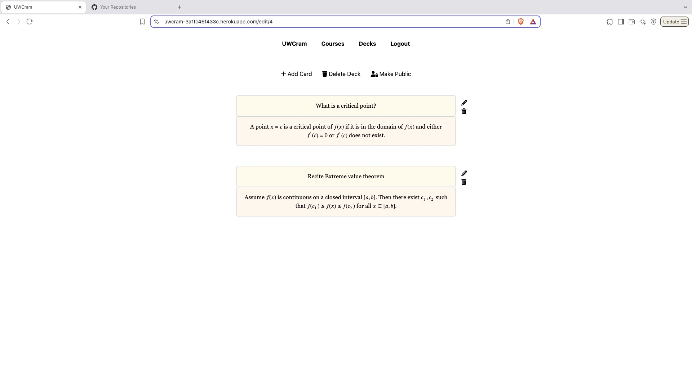

<h1 align="center">Uwcram 📚</h1>
<p align="center">
  A full‑stack web platform for University of Waterloo students to share <em>Anki</em> flashcards & study notes.<br>
  <a href="https://uwcram-3a1fc46f433c.herokuapp.com/">Live&nbsp;Demo&nbsp;↗︎</a>
</p>

<div align="center">
  
  
  
</div>

---

## ✨ Features
- Robust **Django** backend (authentication, REST‑style APIs, CRUD for cards & notes).
- Automated web‑scraping with **Beautiful Soup** to ingest official course data.
- Responsive, student‑friendly UI (HTML + CSS + JavaScript).
- One‑click deploy to **Heroku**.
- **LaTeX support** and live preview when writing the flashcards!

---


## 📸 Preview

- Watch the live video demo of the main features here!

<p align="center">
  <a href="https://www.youtube.com/watch?v=A2U0cy3yJAU" target="_blank">
    
  </a>
</p>

- Here are some images of the website!

<p align="center">
  
  
  
</p>


---

## 🚀 Quick Start (Local Development)

> **Prerequisites**  
> – **Git**, **Conda**  
> – **Python 3.11** (automatically handled by the steps below)  

```bash
# 1. Clone the repository
git clone https://github.com/GunaDD/uwcram.git
cd uwcram

# 2. Create & activate a fresh environment (Python 3.11)
conda create -n uwcram python=3.11
conda activate uwcram

# 3. Install dependencies
pip install -r requirements.txt

# 4. Apply migrations (expect "No changes detected" if up‑to‑date)
python manage.py makemigrations
python manage.py migrate

# 5. Fire up the dev server
python manage.py runserver  # visit http://127.0.0.1:8000/
```

## ☁️ Deploying to Heroku

Note: Heroku CLI must be installed & logged in.
macOS users can install via Homebrew:
```bash
brew install heroku/brew/heroku
```

```bash
# 1. Log in and create an app (replace NAME with your unique slug)
heroku login
heroku create uwcram-yourinitials # because uwcram is taken already by the current live demo

# 2. Deploy the current main branch
git push heroku main

# 3. Open in your browser 
heroku open
```


## 🤝 Contributing

Pull requests are welcome! Check the open issues, fork the repo, create a feature branch, and submit a PR.

```bash
git checkout -b feature/my-cool-idea
git commit -m "Add amazing feature"
git push origin feature/my-cool-idea
```
